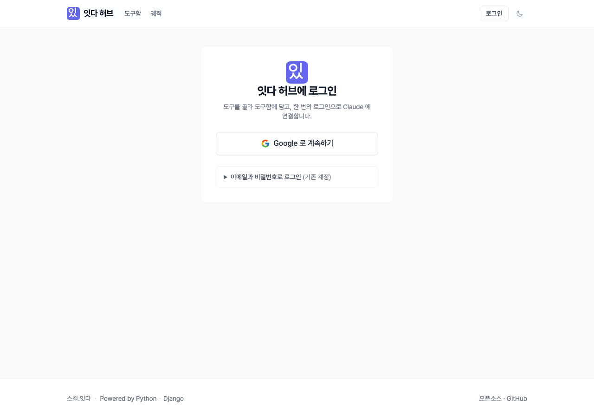
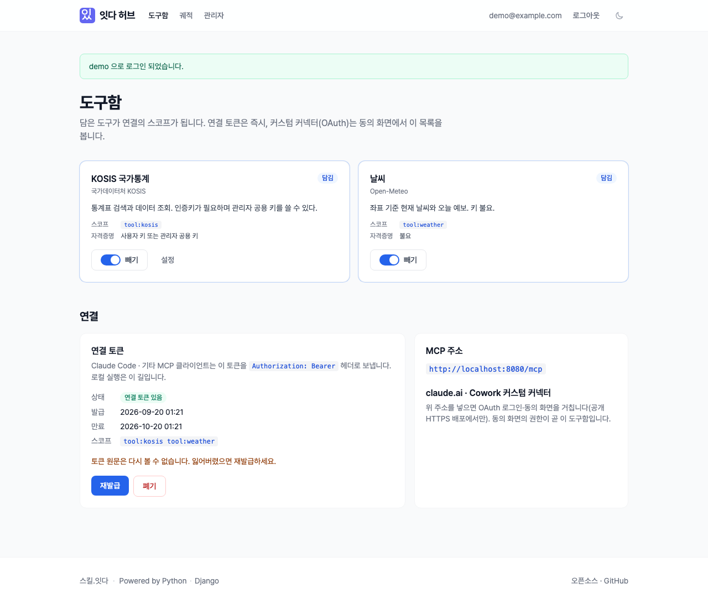
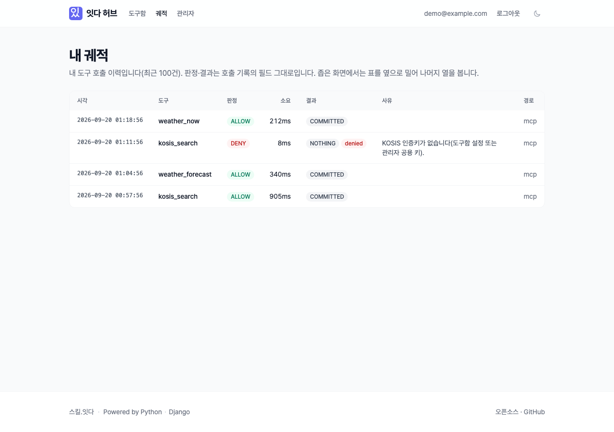
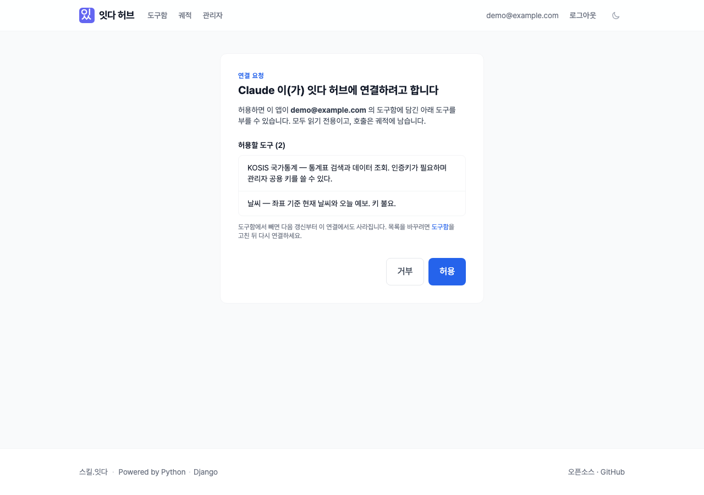

# 잇다 허브 (itda-hub)

> 도구를 골라 **도구함**에 담고, 한 번의 로그인으로 Claude·Cowork·Claude Code 에 연결하는 오픈소스 MCP 허브.
> 사내 도구 카탈로그 · 사용자별 도구함 · 자격증명 금고 · 궤적(감사) 을 Django 위에 세운다.
> 판정과 궤적은 [django-itda](https://github.com/itda-work/django-itda) 가 맡고, 이 저장소는 그 첫 외부 소비자다.

- 지원 버전: **Python 3.14 · Django 6.1** · django-itda v0.4.0(태그 고정) · django-allauth 65 · django-oauth-toolkit 3.4 · fastmcp 4. 조직 정책 "항상 최신 안정판" — pytest 는 폐기 경고를 실패로 본다.
- 상태(2026-09-20): **로컬 docker compose 에서 끝까지 돈다** — 로그인 → 도구함 → 연결 토큰 → MCP 클라이언트가 스코프대로 도구를 보고 부른다 → 궤적. 커스텀 커넥터(OAuth) 왕복은 공개 HTTPS 배포 뒤 스파이크로 남아 있다([#1](https://github.com/itda-work/itda-hub/issues/1)).
- 운영 주소(예정): `https://hub.itda.work` · MCP 엔드포인트 `https://hub.itda.work/mcp`
- 라이선스: MIT. 도구 어댑터가 [스킬.잇다 스킬팩](https://github.com/itda-skills)의 코드를 가져오면 그 파일은 Apache-2.0 헤더와 NOTICE 를 유지한다.

## 무엇인가

PlayMCP 의 소비자 쪽 모양을 Django 로 세운 것이다. 세 층이 있다.

| 층 | 무엇 | 어디에 |
|---|---|---|
| 사람 → 허브 | 로그인해 카탈로그에서 도구를 도구함에 담고, 도구별 설정(내 API 키 또는 관리자 공용 키)을 둔다. 운영은 Google 로그인, 로컬·자체 호스팅은 이메일+비밀번호 | Django 웹 (`hub/`, `apps/`) |
| 클라이언트 → 허브 | ① 커스텀 커넥터(claude.ai·Cowork)는 허브의 OAuth 인가 서버(django-oauth-toolkit 3.4, PKCE·CIMD·DCR)로 사용자 동의를 받는다 — **동의 화면의 스코프가 곧 도구함**. ② 운영·스모크용 **연결 토큰**(`issue_token` 커맨드만 발급, 화면에는 없다)을 Bearer 로 보낸다 — 스코프는 도구함을 따라간다 | `apps/oauth`, `apps/toolbox/tokens.py` |
| 도구 실행 | 별도 프로세스의 MCP 서버(fastmcp 4, Streamable HTTP)가 토큰을 introspection 으로 검증하고, 토큰의 스코프대로 도구 목록을 거른 뒤, 사용자의 설정으로 도구를 부른다. 모든 호출은 궤적으로 남는다 | `mcp_server/` |

두 연결 방식의 토큰은 같은 저장소(DOT `AccessToken`, 원문은 저장하지 않고 체크섬만)에 있고 MCP 서버는 둘을 구분하지 않는다. Django 안에 MCP 를 호스팅하지 않는다 — django-itda 의 결정을 따른다("LLM 은 월드 서버의 클라이언트").

## 화면

스킬.잇다(`itda.work`)와 같은 디자인 계열 — Pretendard, 같은 색·간격, 라이트/다크(오른쪽 위 토글, 사이트와 같은 `theme` 저장 키). 모바일 폭에서도 쓸 수 있다.

| 로그인 | 도구함 | 궤적 | 연결 동의(OAuth) |
|---|---|---|---|
|  |  |  |  |

- **로그인** — Google 이 켜져 있으면 「Google 로 계속하기」가 1차 액션이고, 이메일+비밀번호는 접힌 2차(기존 계정·비상용 관리자)다. Google 이 없으면(로컬·자체 호스팅) 이메일+비밀번호 폼과 가입 안내가 바로 보인다.
- **도구함** — 도구 카드(아이콘·이름·설명·출처·스코프, 오른쪽 `+` 담기 / `✓` 담김 토글, 설정 — 자격증명이 필요한 도구는 설정을 저장해야 담긴다)와 연결 카드(claude.ai·Cowork 커스텀 커넥터 안내 · MCP 주소 복사). 화면에는 OAuth 커넥터만 노출한다 — 연결 토큰은 `issue_token` 커맨드 전용.
- **궤적** — 시각·도구·판정·소요·결과·사유·경로. 판정은 필드(`ALLOW`/`DENY`/…) 그대로 배지로 낸다.
- **연결 동의** — 앱 이름과 허용할 도구(= 내 도구함)를 보여 주고 허용/거부를 고른다.

CSS 는 Tailwind 로 빌드해 `static/css/hub.css` 로 커밋한다(`just css`, 런타임에 Node 불필요). 다크 스크린샷 등 전체는 [docs/reports/screens/](docs/reports/screens/).

## 빠른 시작 (docker compose)

필요한 것: Docker(compose v2), [uv](https://docs.astral.sh/uv/), [just](https://just.systems).

```bash
just env     # .env 생성 — SECRET_KEY·암호화 키·introspection 시크릿·관리자 비밀번호를 채운다
just up      # hub-web :8000 · hub-mcp :8080 (127.0.0.1 에만). 포트가 겹치면 .env 의 HUB_WEB_PORT/HUB_MCP_PORT 와 두 주소를 바꾼다
```

1. `http://localhost:8000` 에 `.env` 의 `HUB_ADMIN_EMAIL` / `HUB_ADMIN_PASSWORD` 로 로그인한다(Google 자격이 없으면 이메일+비밀번호 회원가입도 열려 있다).
2. 도구함에서 「날씨」를 담는다(`+`).
3. 연결 토큰을 받아(`just token admin@example.com`) Claude Code 에 붙인다: `claude mcp add --transport http itda-hub http://localhost:8080/mcp --header "Authorization: Bearer <토큰>"` — 대화에서 "서울 날씨 알려줘". 로컬은 HTTPS 가 아니라 커스텀 커넥터(OAuth) 대신 이 길로 잰다.
4. 「궤적」에서 방금 호출이 남은 것을 본다. 「날씨」를 빼면 다음 `tools/list` 부터 사라진다.

명령줄로만 하려면: `just token admin@example.com --tools weather,kosis --shared` 가 도구함을 채우고 토큰을 찍는다. `HUB_TOKEN=<토큰> just smoke` 가 진짜 MCP 클라이언트(fastmcp)로 목록·날씨·KOSIS 를 한 번씩 부른다(토큰 없이는 거부되는 것까지 잰다).

KOSIS 는 인증키가 필요하다 — `.env` 의 `SHARED_KOSIS_API_KEY`(관리자 공용) 또는 도구함 설정의 개인 키. 없으면 호출이 `ToolDenied` 로 거부되고 그 사실이 궤적에 남는다.

## 호스트에서 직접 (uv)

```bash
just env && just setup   # uv sync → migrate → seed_catalog → bootstrap
just run                 # http://localhost:8000
just mcp                 # http://localhost:8080/mcp
just check               # ruff · manage.py check --fail-level WARNING · 마이그레이션 누락 · pytest
```

## 운영

`compose.prod.yml` 오버레이를 얹는다 — 호스트 포트 미노출, 워커 1, 로그 회전, SQLite 온라인 백업(`hub-backup`). 스킬.잇다 웹사이트 VM 에는 그쪽 compose 가 두 파일을 include 하고 Caddy 가 `hub.itda.work` 를 `hub-web:8000`·`hub-mcp:8080`(`/mcp`)으로 보낸다. 운영 `.env` 는 `.env.example` 의 「운영」 절, 절차·검증(로컬 스모크 → 원격 스모크 → 커스텀 커넥터 OAuth 왕복)은 [docs/deploy.md](docs/deploy.md).

## v1 범위

- 로그인: Google(django-allauth, 자격이 있을 때만 켜짐) · 이메일+비밀번호(`HUB_LOCAL_LOGIN`, 로컬 기본값). Google 이 켜지면 새 계정은 Google 로만 — 비밀번호는 기존 계정(비상용 관리자)의 로그인만.
- 카탈로그 4종: KOSIS 통계 검색, 날씨(공개), 환율·유가(어댑터 준비 중 — 비공개). 전부 HTTPS GET, 읽기 전용.
- 도구함, 도구별 설정(암호화 저장), 관리자 공용 키.
- 연결 방식 둘: OAuth 인가 서버(CIMD 우선, DCR 병행, PKCE S256 · RFC 9700 — implicit·password·plain 거부, RFC 9207 `iss`, refresh 재사용 탐지, 운영은 https 콜백만) · 연결 토큰(`issue_token` 커맨드 전용 — 화면 없음, 30일, 사용자당 하나).
- 요청 단위 도구 목록 필터(스코프), 궤적 화면, 관리자 열람.
- 배포: docker compose(hub-web + hub-mcp, SQLite WAL 공유) — 운영은 `compose.prod.yml` 을 얹고 리버스 프록시만 앞에 둔다.

비목표(v1): 외부 MCP 서버 등록·중계, 쓰기 도구, 결제.

## 구조

```
hub/            Django 프로젝트 · 설정은 환경변수(.env.example) · healthz
templates/      화면(공통 셸 base.html · allauth 요소 · DOT 동의 화면 · 404/500)
static/         src/tailwind.css → css/hub.css(just css, 커밋) · js/theme-boot.js · js/hub.js(테마·복사)
apps/accounts   로그인 · bootstrap(환경변수로 앱·관리자 보장) · backup_db(SQLite 온라인 백업)
apps/catalog    도구 카탈로그 · 도구별 스코프 정의 · seed_catalog
apps/toolbox    사용자 도구함 · 도구별 설정(암호화) · 연결 토큰(tokens.py, issue_token)
apps/oauth      인가 서버 설정 · 동의 화면(스코프 = 도구함)
apps/trajectory 궤적 화면(django-itda ToolCall 위)
mcp_server/     별도 프로세스 · fastmcp HTTP · introspection 검증 · 도구 어댑터
scripts/        make_env(.env 생성) · mcp_smoke(MCP 왕복 스모크)
compose.yml     hub-web + hub-mcp · deploy/entrypoint.sh 가 migrate → seed → bootstrap
compose.prod.yml 운영 오버레이(포트 미노출 · 워커 1 · 로그 회전 · hub-backup)
docs/           아키텍처 · 배포 · 강의 가이드
```

## 문서

- [docs/architecture.md](docs/architecture.md) — 두 겹의 OAuth, 연결 토큰, 스코프 = 도구함, 프로세스 경계
- [docs/deploy.md](docs/deploy.md) — 로컬 compose · 운영 오버레이 · 동거 배포 · 백업 · 검증 절차
- [docs/lecture-guide.md](docs/lecture-guide.md) — 교육생 연결 가이드(Cowork · Claude Code)
- [CHANGELOG.md](CHANGELOG.md) · [CONTRIBUTING.md](CONTRIBUTING.md) · [SECURITY.md](SECURITY.md)
