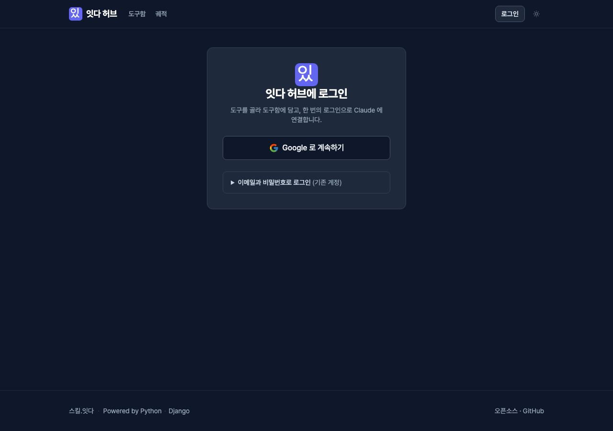
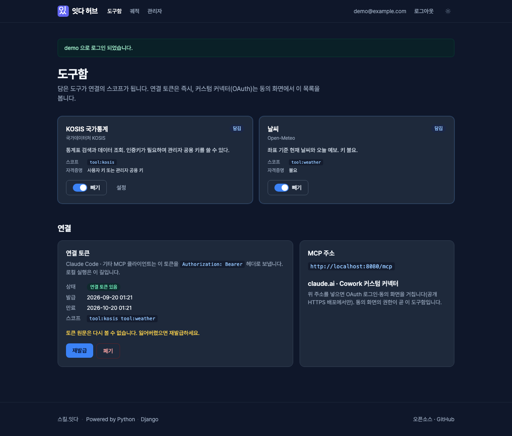
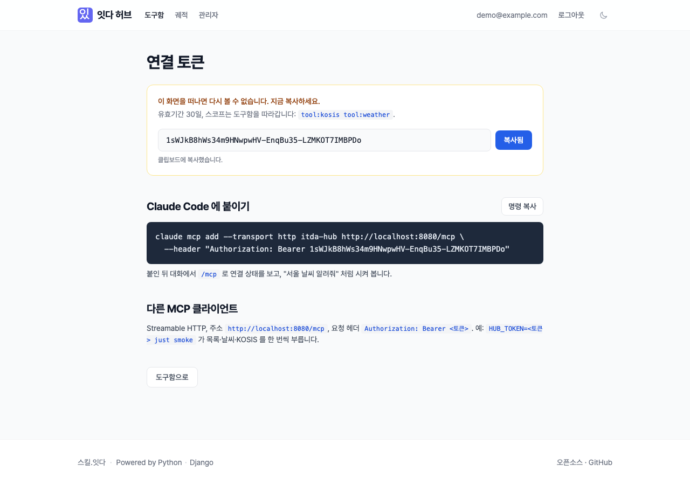
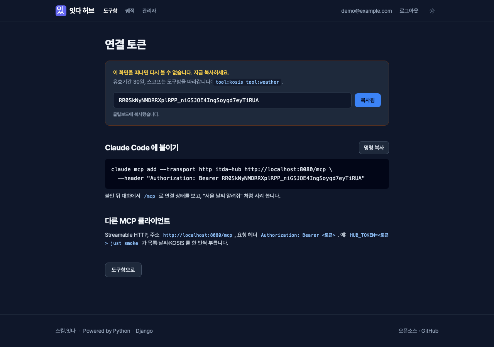
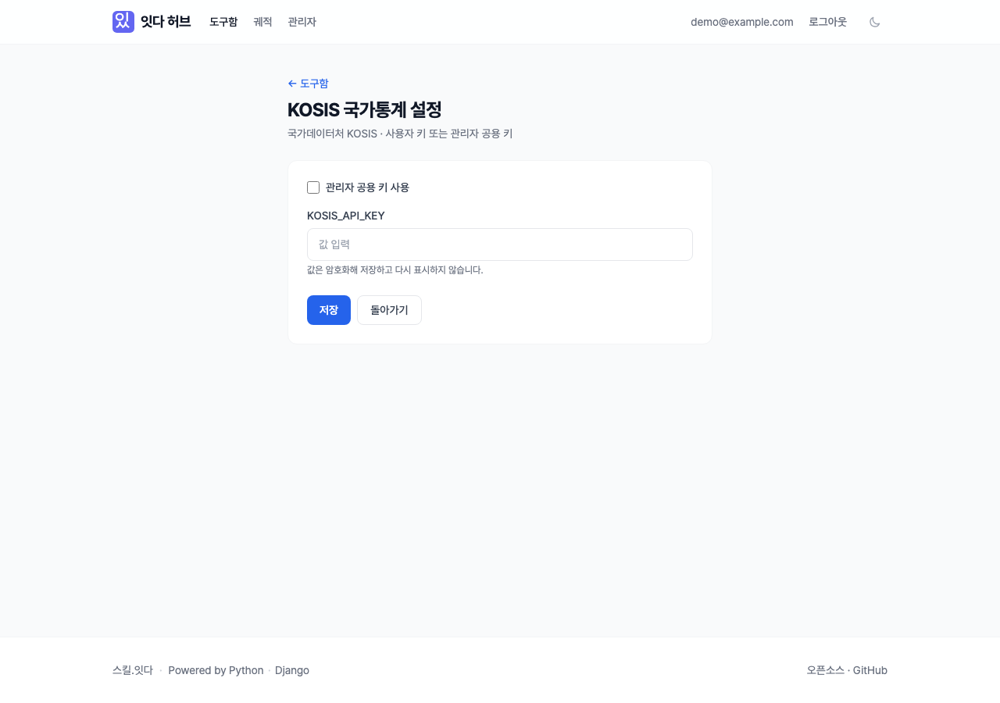
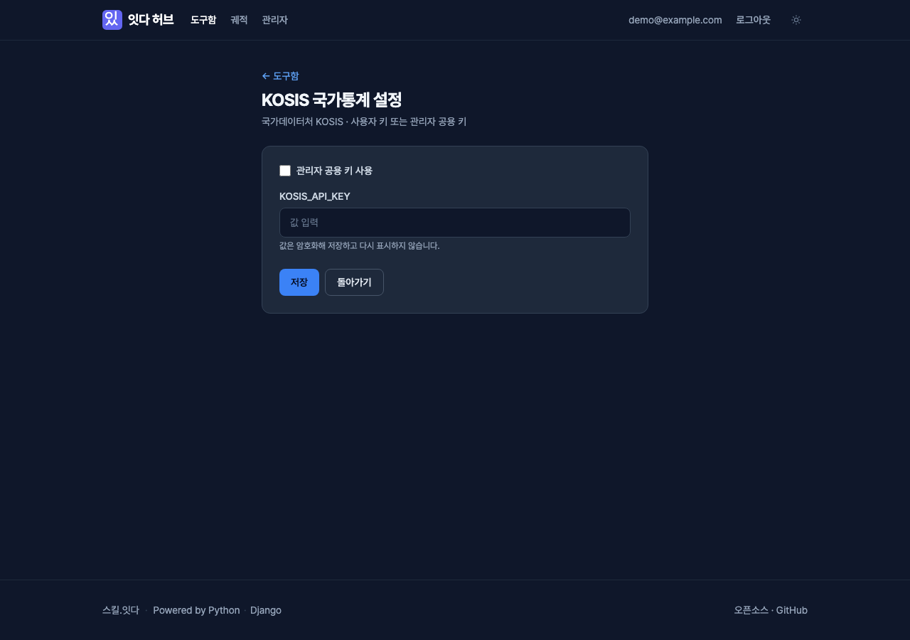
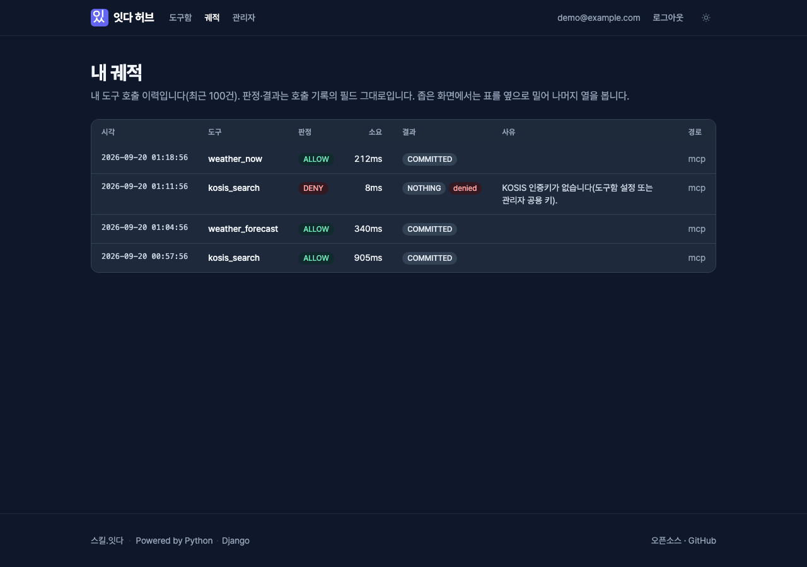
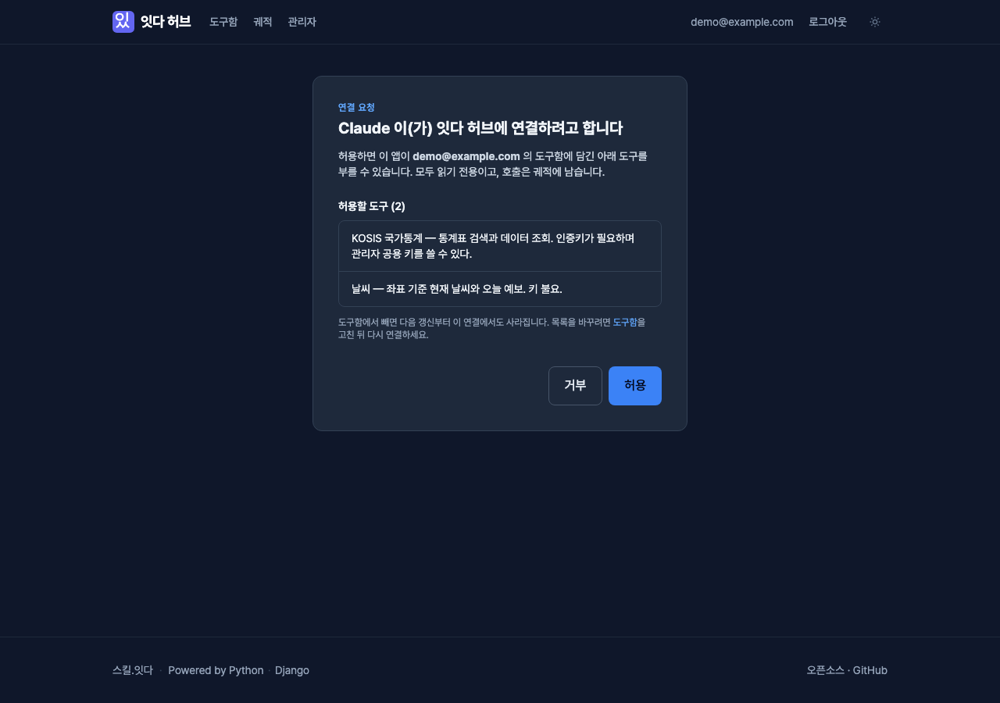
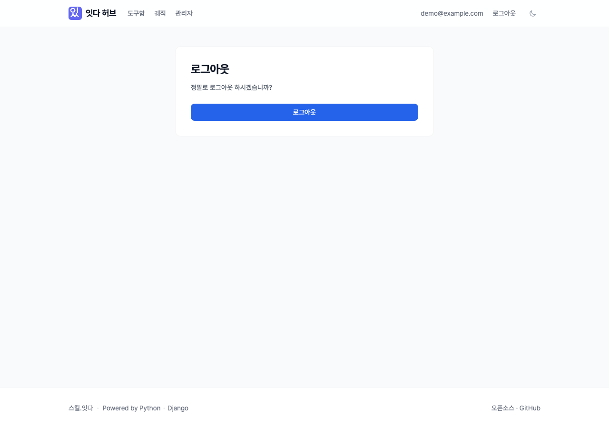
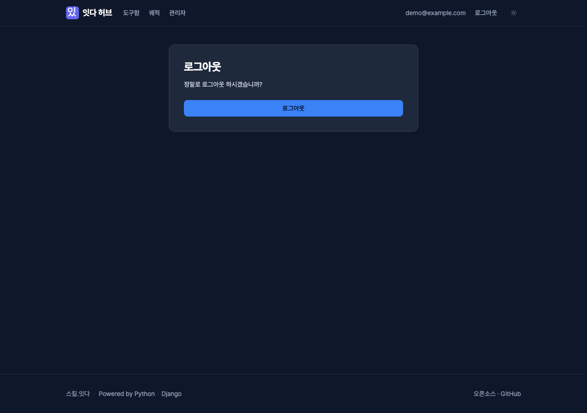

# H-4 보고서 — itda-hub UI: 스킬.잇다와 한 브랜드로 (Tailwind, 정적 CSS)

- 일자: 2026-09-20 · 저장소 `itda-work/itda-hub` main(v0.2.1 이후) · 버전 **0.3.0** · 커밋만(푸시·태그 없음 — `v0.3.0` 태그는 오케스트레이터 몫)
- 참고(읽기 전용): 스킬.잇다 웹사이트 저장소 `renew-to-django` 의 `tailwind.config.cjs`·`static/src/tailwind.css`·`templates/base.html`·`partials/{header,footer,theme_toggle}.html`·`accounts/login.html`·`scripts/build-css.sh`·`static/js/{head-boot,theme}.js`·`.github/workflows/ci.yml`(css 잡)·`docs/DEVELOPMENT.md`. 브리프가 적은 `partials/nav.html` 은 없고 `header.html` 이 그 자리다.

## 결론

완료 조건 전부 충족. 기능·모델·URL·OAuth 흐름·폼 필드 이름은 바뀌지 않았다. 설정 파일에는 **정적 파일 경로 한 줄**(`STATICFILES_DIRS`)만 더했다 — 없으면 새 CSS/JS 를 collectstatic·whitenoise 가 찾지 못해 운영 화면이 CSS 없이 뜬다(아래 「경계에 대한 판단」).

| 조건 | 결과 |
|---|---|
| `just check` | 통과 — ruff · format · `check --fail-level WARNING` · 마이그레이션 누락 없음 · pytest **103 passed**(이전 57) |
| CSS 빌드 diff 0 | `bash scripts/build-css.sh` 뒤 `static/css/hub.css` 작업 트리 변경 없음. CI `css` 잡 추가(사이트와 같은 `git status --porcelain` 가드) |
| 스크린샷 | `docs/reports/screens/` 22장 — 로그인·도구함·궤적·동의 × 라이트/다크 × 데스크톱(1280)/모바일(390), 토큰·설정·로그아웃 확인 × 라이트/다크 |
| 운영 이미지 | `docker build` 성공, 이미지 안 `collectstatic` 에 `hub.<hash>.css`·`hub.<hash>.js`·`theme-boot.<hash>.js`. `DJANGO_DEBUG=0` 로 띄워 로그인 200, 참조된 해시 정적 파일 전부 200, 404 화면이 허브 디자인, `/healthz` JSON 그대로 |

## 할 일별 결과

### 1. 빌드 규약 (사이트와 같음)

- `package.json`(private, ESM) — `tailwindcss ^3.4.17`(설치 3.4.19) + `@tailwindcss/typography ^0.5.19`. 사이트처럼 **bun** 으로 설치·실행(`bun.lock` 커밋, CI 는 `bun install --frozen-lockfile`).
- `tailwind.config.cjs` — 사이트의 `theme.extend` 를 옮겼다: `fontFamily.sans = Pretendard, system-ui`, `darkMode: 'class'`, typography 의 prose 색(기본·invert). 사이트는 **별도 색 팔레트를 정의하지 않고 Tailwind 기본 팔레트**(gray·slate 바탕, blue 강조)를 쓴다 — 허브도 같다. content 글롭도 같은 모양(`templates/**/*.html`·`apps/**/*.py`·`static/js/**/*.js`).
- `static/src/tailwind.css` — 사이트의 base 층(`--color-bg`/`--color-text`, `html` 폰트, `body` 의 `bg-gray-50 dark:bg-slate-900 text-gray-900 dark:text-slate-100`)을 그대로 두고, 허브에서 되풀이되는 조각만 components 층에 이름을 붙였다: `.btn(-primary|-secondary|-danger|-ghost|-lg)`·`.card`·`.link`·`.muted`·`.code-inline`·`.code-block`·`.badge(-*)`·`.hub-form`(위젯에 클래스를 줄 수 없는 Django/allauth 폼의 입력 칸·라벨·도움말·오류). 입력 칸 클래스는 사이트 로그인 폼의 것과 같다.
- `scripts/build-css.sh` → `static/css/hub.css`(minify, **커밋 대상**, 29.6KB). `just css` / `just css-watch`. 런타임(이미지)에는 Node 가 없다 — `.dockerignore` 에 `node_modules`.
- CI(`.github/workflows/ci.yml`) 에 `css` 잡: bun 설치 → 빌드 → `git status --porcelain -- static/css/hub.css` 가 비어 있지 않으면 실패.
- 인라인 `<style>` 제거(과거 `base.html`), `style="display:inline"` 속성도 제거.
- whitenoise 는 이미 있었다. `STATICFILES_DIRS = [BASE_DIR / 'static']` 추가.

### 2. 레이아웃 `templates/base.html`

- 상단(사이트 헤더와 같은 `sticky … bg-white/90 dark:bg-slate-900/90 backdrop-blur border-b`): 로고(사이트 `favicon.svg` 복사 — 인디고 바탕 「있」) + 워드마크 「잇다 허브」 · 도구함 · 궤적 · 관리자(`is_staff` 만) · 이메일 · 로그아웃(POST 폼 그대로)/로그인 · 테마 토글. 현재 화면은 `aria-current="page"`.
- 모바일: 햄버거(JS) 대신 네비를 둘째 줄로 내리는 `flex-wrap` — 링크가 셋뿐이라 스크립트 없이 충분하다. 이메일은 `sm` 이상에서만.
- 본문 `main#main`(기본 `max-w-5xl`, 화면별 `main_class` 블록), 「본문으로 건너뛰기」 링크, `messages` 배너(수준별 색, `role="status" aria-live="polite"`).
- 푸터: 「스킬.잇다」(→ `https://itda.work`) · 「Powered by Python · Django」(사이트 푸터와 같은 링크) · 「오픈소스 · GitHub」.
- 다크 모드: 사이트와 같은 계약 — `html.dark` 클래스 하나, `localStorage` 키 `theme`(`light`|`dark`), 기본 light, 시스템 선호 미사용. `<head>` 의 **동기 정적 파일** `static/js/theme-boot.js` 가 첫 페인트 전에 클래스를 맞추고(M7-G 규약 — 인라인 스크립트 0), `static/js/hub.js`(defer)가 토글·다른 탭 동기화를 한다. 해/달 아이콘은 `dark:hidden`/`dark:block` CSS 로만 바뀐다.
- allauth 화면은 `templates/allauth/layouts/{entrance,manage}.html` 이 카드로 감싼다(base 에 `main_inner` 블록을 두어 `content` 를 감쌀 수 있게 했다).

### 3. 화면

| 화면 | 내용 |
|---|---|
| 로그인 `account/login.html` | allauth 65 사본의 허브판. Google(소셜 제공자)이 있으면 「Google 로 계속하기」를 로고와 함께 **1차 액션**으로 맨 위에, 이메일+비밀번호는 `
` 로 **접힌 2차**(「기존 계정」 — 폼 오류가 있으면 펼친 채). Google 이 없으면 비밀번호 폼이 1차로 바로. 가입 안내는 `HUB_LOCAL_SIGNUP` 일 때만(v0.2.1 정책 유지). 폼은 `account/snippets/hub_login_form.html` 로 뺐고 필드 이름·`action`·`redirect_field` 는 원본 그대로 |
| allauth 나머지 | `templates/allauth/elements/*`(h1·h2·p·hr·alert·badge·form·fields·field·button·button_group·details·provider_list·provider·panel)를 입혀 가입·가입 닫힘·비밀번호 재설정·로그아웃 확인·Google 확인 화면이 같은 모양. `fields` 는 `form.as_p` 대신 필드마다 `label for` + 위젯 + 도움말 + 오류 |
| 도구함 `toolbox/home.html` | 도구 카드(이름·출처·설명·스코프·자격증명, 「담김/안 담김」 배지, 스위치 모양의 담기/빼기 버튼 — 기존과 같은 POST 폼, 담긴 도구는 「설정」). 연결 카드(토큰 상태·발급·만료·스코프, 발급/재발급/폐기) + MCP 주소·커스텀 커넥터 안내 카드 |
| 연결 토큰 `toolbox/token.html` | 「한 번만 보인다」 경고 카드, 토큰 칸(`select-all`) + **복사 버튼**, Claude Code 연결 명령 코드 블록 + 명령 복사, 다른 클라이언트 안내. 복사 버튼은 `hub.js` 가 켤 때까지 `hidden` — 스크립트가 없으면 버튼 없이 직접 선택. Clipboard API 가 없는 평문 origin 은 `execCommand('copy')` 폴백. 토큰은 화면에 있는 값을 클립보드로만 옮기고 어디에도 보내지 않는다 |
| 도구 설정 `toolbox/setting.html` | 체크박스·입력 칸에 `id` + `label for`, 도움말은 `aria-describedby`. 필드 이름(`use_shared`·`value`) 그대로 |
| 궤적 `trajectory/mine.html` | 표(시각·도구·판정·소요·결과·사유·경로, `th scope="col"`, `time datetime`). 판정은 필드값 그대로 배지(`ALLOW` 초록·`DENY` 빨강·그 밖 주황), 오류 갈래는 빨간 배지. 좁은 화면은 앞 네 열이 먼저 보이고 가로 스크롤, 시각을 `m-d H:i` 로 줄인다. 빈 상태는 안내 카드 |
| OAuth 동의 `oauth2_provider/authorize.html` | DOT 3.4 원본의 허브판(계약 같음 — 숨은 필드 전부, 거부 = 이름 없는 submit, 허용 = `name="allow"`). 앱 이름, 로그인한 이메일, **허용할 도구 = 도구함으로 좁힌 `scopes_descriptions`**(개수 포함), 허용(1차)/거부(2차) 큰 버튼. 오류 분기도 카드로. 빈 도구함 안내(`oauth/empty_toolbox.html`)도 카드 |
| 404 / 500 | 404 는 허브 레이아웃. 500 은 Django 가 컨텍스트 없이 렌더하므로 `base.html` 을 잇지 않는 독립 문서(정적 파일만) |
| `/healthz` | 무영향(JSON, 템플릿 없음) — 기존 테스트 그대로 통과 |

브리프의 「궤적 필터 유지」: 현재 궤적 뷰에는 필터가 없다(최근 100건 고정). 필터를 새로 만드는 것은 기능 변경이라 하지 않았다.

### 4. 접근성·품질

- `lang="ko"`, 모든 입력 칸에 라벨 연결, 포커스 링(`:focus-visible` → `ring-2 ring-blue-500/60` + 오프셋, 입력 칸은 사이트와 같은 `focus:ring`), 건너뛰기 링크, 장식 SVG `aria-hidden`, 테마 토글 `aria-pressed`, 복사 결과 `aria-live`.
- 대비: 본문 `gray-900`/`slate-100`, 보조 문구 `gray-500`/`slate-400`(사이트와 같은 값), 1차 버튼 라이트 `blue-600` 위 흰 글씨 · 다크 `blue-500` 위 `slate-950` 글씨.
- 인라인 이벤트 속성·인라인 스크립트·`<style>`·`style=` 0.
- 테스트(새로 46건):
  - `tests/test_templates_static.py` — 템플릿 전체(주석 제외)에서 `<style>`·`style=`·src 없는 `<script>`·`on*=` 0, `base.html`/`500.html` 의 `lang="ko"`·`hub.css`·`theme-boot.js`, `hub.css` 에 핵심 컴포넌트·minify, 테마 저장 키가 사이트와 같음, staticfiles finder 가 새 파일을 찾음.
  - `tests/test_screens.py` — 로그인(로컬 전용: 라벨·가입 링크·접지 않음), 가입·비밀번호 재설정, 로그아웃 확인(GET 200 + POST 302), 도구함(카드·폼 action·토큰 발급·관리자 링크는 스태프만), 설정 라벨, 토큰 화면(원문은 토큰 칸과 명령 예시 두 곳뿐, 복사 버튼 둘), 궤적(빈 상태·표·배지), **동의 화면을 렌더된 폼 그대로 다시 보내 허용 → `code`, 거부 → `access_denied`**.
  - `tests/test_production_settings.py`(운영 env 새 프로세스, Google 켬) — 로그인 화면에서 Google 링크가 비밀번호 칸보다 앞이고 비밀번호는 닫힌 `
` 안, `DEBUG=0` 의 404 가 허브 디자인, 500 이 컨텍스트 없이 렌더됨.
- 음성 대조: 템플릿 하나에 `onclick=` 과 새 클래스(`bg-fuchsia-900`)를 넣으면 정적 검사가 실패하고, 빌드하면 `hub.css` 가 바뀐다(= CI css 잡이 잡는다). 원복 뒤 재빌드 결과가 커밋본과 바이트 동일.
- 브라우저 실측(Playwright, 로컬 runserver): 토큰 복사 → 클립보드 값 = 화면의 토큰, 「복사됨」/상태 문구 표시, 명령 복사 → `claude mcp add …`, 테마 토글 → `html.dark` + `localStorage theme=dark`, 새로고침 뒤 유지. 콘솔 오류는 의도한 404 요청 둘뿐.

### 5. 스크린샷

`uv run --with playwright`(캐시된 chromium)로 찍었다. 데이터는 임시 SQLite 의 가상 계정(`demo@example.com`, 스태프)·가상 궤적 4건·가상 앱 「Claude」. 서버는 Google 자격을 가짜 값으로 켜서 운영과 같은 로그인 배치를 보였고, 로그인은 접힌 이메일 폼으로 했다. 토큰은 버린 로컬 DB 의 것이다.

| | 라이트 | 다크 | 모바일(라이트/다크) |
|---|---|---|---|
| 로그인 |  |  | [라이트](screens/login-light-mobile.png) · [다크](screens/login-dark-mobile.png) |
| 도구함 |  |  | [라이트](screens/toolbox-light-mobile.png) · [다크](screens/toolbox-dark-mobile.png) |
| 연결 토큰 |  |  | — |
| 도구 설정 |  |  | — |
| 궤적 |  |  | [라이트](screens/trajectory-light-mobile.png) · [다크](screens/trajectory-dark-mobile.png) |
| 연결 동의 |  |  | [라이트](screens/consent-light-mobile.png) · [다크](screens/consent-dark-mobile.png) |
| 로그아웃 확인 |  |  | — |

찍으면서 고친 것: 모바일에서 `code-inline` 이 `break-all` 이라 `Authorization` 이 글자 중간에서 끊겼다 → `break-words`. 모바일 궤적 표에서 판정 열이 화면 밖에 있었다 → 열 순서를 시각·도구·판정·소요 먼저로, 시각을 줄여 표시.

### 6. 문서·버전

- README 「화면」 절(스크린샷 표·화면별 설명·CSS 빌드), 호스트 명령에 `just css`, 구조에 `templates/`·`static/`.
- CONTRIBUTING 규칙에 화면 규약(`just css` 후 함께 커밋, 인라인 금지).
- CHANGELOG `[0.3.0]`, `pyproject.toml`·`uv.lock` 버전 0.3.0(`uv lock --check` 통과).

## 경계에 대한 판단

- **설정 한 줄(`STATICFILES_DIRS`)** — 브리프 경계는 「설정 무변경」이지만, 저장소에 프로젝트 수준 `static/` 이 처음 생겨 이 경로 없이는 운영(매니페스트 저장소)에서 `` 가 렌더 오류가 난다. 화면 자산 경로만 더하고 다른 값은 건드리지 않았다. 테스트(`finders.find`)와 운영 이미지 실측으로 고정.
- `static/src/tailwind.css` 도 collectstatic 에 실린다(무해한 소스 CSS). 뺄 수도 있지만 사이트도 같은 구조라 그대로 두었다.
- Pretendard 는 사이트와 같은 jsDelivr CDN(`pretendard@v1.3.9`). 허브에는 아직 CSP 가 없어 추가 설정이 필요 없다. CSP 를 걸 때는 `style-src` 에 `cdn.jsdelivr.net` 이 필요하다(스크립트는 이미 `'self'` 만으로 충분).
- Django admin 화면은 건드리지 않았다(브리프 범위 밖).

## 남은 질문

1. 궤적 필터(도구·판정·기간)를 둘지 — 지금은 필터가 없어 「유지」할 것이 없었다. 두려면 뷰 변경이라 별도 과업.
2. 사이트와 허브가 `theme` 키를 같이 쓰지만 origin 이 달라(`itda.work` ↔ `hub.itda.work`) 선택이 공유되지 않는다. 공유하려면 쿠키(도메인 `.itda.work`) 방식으로 두 저장소를 함께 바꿔야 한다.
3. `static/img/favicon.svg` 는 사이트 파일의 복사본이다. 로고가 바뀌면 둘 다 바꿔야 한다.
